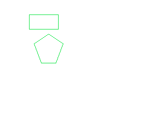

# GJK Collision Detection and EPA
[Click here for a demo](https://jshin313.github.io/gjk-epa)

Implementation of GJK and EPA algorithm for collision detection and response for native builds, WebASM, and the TI-84+ CE



## Building
* Native builds: `make`
* WebAssembly: `make wasm` and then run `./public/serve.sh` to host the wasm files
* TI-84+ CE: `make ti` and transfer the `bin/GJK.8xp` file to your calculator

## Dependencies
* TI-84+ CE
    * [CE Toolchain](https://ce-programming.github.io/toolchain/static/getting-started.html)
    * Transfer clibs to your calculator: https://tiny.cc/clibs
* WebASM
    * [emcc](https://emscripten.org/docs/getting_started/downloads.html)
* Native
    * make, clang

The core `src/gfx/` code doesn't require anything special, but you need the SDL2 and SDL_gfx for the demo of the library for native and WebASM
* SDL2
* SDL2_gfx
```
 sudo apt-get install libsdl2-dev
 sudo apt-get install libsdl2-gfx-dev
```

## Directories
* `public`: WebASM `index.html` and `index.js`
    * `serve.sh` starts a simple server to start the WebASM
* `bin`: Native binary and 8xp files
* `src`: Source code

## Resources
`src/gjk/gjk.c` is heavily based on the following resources:
 * https://youtu.be/ajv46BSqcK4?si=FwvnEZ4qwEg9061W&t=1756
    * Very nice explanation on how GJK works
 * https://dyn4j.org/2010/04/gjk-gilbert-johnson-keerthi/
    * More comprehensive examples with concrete numbers and calculations
 * https://dyn4j.org/2010/04/gjk-distance-closest-points/
    * How to also get the closest points on two polygons with GJK
 * https://blog.hamaluik.ca/posts/building-a-collision-engine-part-2-2d-penetration-vectors/
    * Nice explanation of EPA
 * https://dyn4j.org/2010/05/epa-expanding-polytope-algorithm/
    * Another explanation of EPA with more examples

## TODO
* Do better error handling with enums
    * https://stackoverflow.com/questions/385975/error-handling-in-c-code
* Tidy up loop.c
* Replace minkowski diff in support function
* Split up demos for collision detection (GJK) and collision response (EPA)
